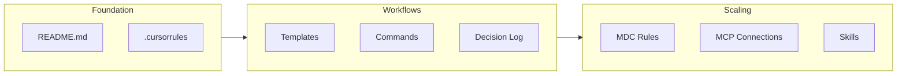

# AI Co-Pilot for PMs: Talk + Workshop Plan

## Session Structure

```
15 min  - Intro
30 min  - Theory (slides)
60 min  - Practice (live Cursor demo)
15 min  - Closing
```

---

## Part 1: Intro (15 min)

**Goal**: Set the stage, build credibility, and frame why this matters now.

**Slide flow:**

- **Title slide** - Working title: *"AI as Your PM Co-Pilot: From Ideas to Execution"*
- **Who am I** - Brief intro. PM managing a full stream + team. Daily AI user, not an AI evangelist. Pragmatic approach.
- **The shift** - The friction dropped. People who were on the sidelines can now ship. Reference Part 1 opening: *"Engineers who needed an afternoon can produce a first version by lunch. The PM who always had ideas but depended on someone else can finally get their hands dirty."*
- **What we'll cover today** - Agenda overview: Theory (why this matters) + Practice (build something together). Set expectations: *"By the end you'll have a mental model for how to start using AI as a working partner, and you'll see a project built from zero."*

---

## Part 2: Theory (30 min)

**Goal**: Cover three themes with external references. Not a lecture — more like a curated argument with supporting evidence.

### Theme 1: Velocity and Speed (10 min)

Key points per slide:

- **Slide: "The new speed"** - AI compresses the build-measure-learn cycle. What used to take days (draft a spec, prototype, analyze results) can now happen in hours. The bottleneck shifts from execution to judgment.
- **Slide: "What gets faster (and what doesn't)"** - Faster: first drafts, data parsing, boilerplate, repetitive docs. NOT faster: strategic thinking, stakeholder alignment, user empathy. The PM's value shifts from "producing artifacts" to "directing and curating."
- **Slide: "Evidence"** - Reference external sources:
  - [McKinsey: "The economic potential of generative AI"](https://www.mckinsey.com/capabilities/mckinsey-digital/our-insights/the-economic-potential-of-generative-ai-the-next-productivity-frontier) - productivity gains in knowledge work
  - [Lenny Rachitsky: "How AI is changing product management"](https://www.lennysnewsletter.com/) - survey data on PM adoption
  - [a]16z or similar on "AI-native product development" velocity benchmarks

### Theme 2: How AI Affects the PM Role (10 min)

Key points per slide:

- **Slide: "PM in the loop, not out of the loop"** - AI supports the PM in making decisions, it does not make the decision. The human stays accountable for judgment, context, and trade-offs. Reference your own rule: *"Helping the PM make a decision, not making the decision for the PM."*
- **Slide: "New PM superpowers"** - Concrete examples: draft AB tests in minutes, summarize 50 experiments, generate insights from data, prototype ideas without engineering dependency. Each maps to what you built in Parts 1-4.
- **Slide: "New PM responsibilities"** - Context engineering (what you feed the AI matters more than the prompt). Quality control (AI output needs review). System design (building reusable workflows, not one-off prompts). Reference:
  - [Teresa Torres: "Context Rot"](https://www.producttalk.org/) - why managing AI context is a PM skill
  - [Aman Khan: "How to build AI Product Sense"](https://www.mindtheproduct.com/)
  - [Tal Raviv: "Context Engineering"](https://substack.com/) - 5 familiar strategies from real product teams

### Theme 3: Collaboration is Changing (10 min)

Key points per slide:

- **Slide: "The new handoff"** - PMs can now prototype and show, not just describe. Designers get concrete starting points. Engineers get clearer specs. The conversation shifts from "can you build this?" to "here's what I'm thinking, let's refine."
- **Slide: "Shared context, not shared tools"** - Teams don't all need to use the same AI tool. What matters is that the artifacts (specs, templates, decision logs) are structured and accessible. Markdown as a lingua franca.
- **Slide: "What to watch out for"** - Over-reliance (AI as crutch vs. tool). Context rot across team members. The "it looks done" trap — AI output looks polished but may lack depth. The PM's job is to catch that.

---

## Part 3: Practice / Live Demo (60 min)

**Goal**: Build an "Initiative Planner" project from scratch in Cursor, progressively introducing the 9 concepts. The audience watches the project grow from an empty folder to a working system.

### Narrative arc

The demo follows a clear progression: **empty folder -> structured project -> smart assistant -> connected system**. Each concept builds on the previous one.

### Demo script

#### Act 1: Foundation (20 min) - Concepts 1-3

**Beat 1 (5 min): Cursor orientation + why not web-based apps** (Concepts 1 + 2)

- Open Cursor. Briefly walk through the interface: editor, chat panel, model selector.
- Explain the key concepts: **instructions** (rules, context files), **context** (what the AI sees), **model** (which LLM), **mode** (ask vs agent).
- Quick comparison with web-based apps: "ChatGPT/Claude are great for one-off questions. But when you're building a system — files that reference each other, rules that persist, templates that get reused — you need something that lives in your file system. That's why I use an IDE."

**Beat 2 (8 min): README.md** (Concept 3, part 1)

- Create a new folder: `Initiative_Planner/`
- Create `README.md` — describe what the project does: *"A system to plan, track, and make decisions on product initiatives."*
- Show the AI can already answer questions about the project just from the README.
- Key point: *"The README is the source of truth. If it's not in the README, the AI doesn't know about it."*

**Beat 3 (7 min): .cursorrules** (Concept 3, part 2)

- Create `.cursorrules` — define project scope (Phase 1), response style, and basic behaviors.
- Show how the AI's behavior changes with rules vs. without (before/after).
- Key point: *"Rules first, then build. The AI needs guardrails from the start."*
- Explain what's automatically in context (.cursorrules) vs. what's not (other files unless referenced).

#### Act 2: Workflows (20 min) - Concepts 4-6

**Beat 4 (8 min): Templates** (Concept 4)

- Create `templates/initiative_brief.md` with a structure (Problem, Goal, Success Metrics, Scope, Risks, Timeline).
- Add a rule in `.cursorrules`: *"For initiative briefs, follow the format in templates/initiative_brief.md."*
- Demo: ask Cursor to draft an initiative brief from a one-line description. Show it follows the template.
- Key point: *"Templates mean consistency. You define the structure once; every draft follows it."*

**Beat 5 (5 min): Context rot + commands** (Concept 5)

- Explain context rot: *"The AI's context is like your desk. After a long chat, it gets cluttered."*
- Create `.cursor/commands/save-context.md` and `.cursor/commands/clear.md`.
- Demo the save-context command: show it appends a summary to `CONTEXT_LOG.md`.
- Key point: *"Save what matters, clear the desk, recover in a new chat."*

**Beat 6 (7 min): Decision log** (Concept 6)

- Create `decisions/` folder and `experiment_log.md`.
- Draft a quick decision memo from the initiative brief created earlier.
- Show the log as a horizontal view across all initiatives.
- Key point: *"If it's not written down, it didn't happen. The log is your institutional memory."*

#### Act 3: Scaling and Connecting (20 min) - Concepts 7-9

**Beat 7 (7 min): MDC files / rules** (Concept 7)

- Create `.cursor/rules/initiative-brief.mdc` with a glob scope (e.g., `initiatives/**/*.md`).
- Show that when you open a file matching the glob, the rule activates automatically.
- Key point: *"MDC lets you scale from one rule file to many, each scoped to where it matters."*

**Beat 8 (7 min): MCP** (Concept 8)

- Show a pre-configured MCP connection (e.g., Jira, Notion, or Statsig — whichever you have set up).
- Demo: ask Cursor to pull data from the connected tool or push an update.
- Key point: *"MCP turns your co-pilot from a local assistant into a connected one. It can read and write to the tools you already use."*

**Beat 9 (6 min): Skills** (Concept 9)

- Show the existing `ab-test-prd` SKILL.md at `[.cursor/skills/ab-test-prd/SKILL.md](.cursor/skills/ab-test-prd/SKILL.md)`.
- Explain: a skill is a reusable workflow the AI follows — like a playbook. It has "when to use," inputs, and a step-by-step workflow.
- Demo: trigger the skill by describing an A/B test idea. Show how the AI follows the skill's workflow automatically.
- Key point: *"Skills turn repeated multi-step actions into one-step commands. You codify your expertise."*

---

## Part 4: Closing (15 min)

**Slide flow:**

- **Slide: "What we built"** - Recap the project: from empty folder to a system with rules, templates, commands, decision logs, scoped rules, MCP, and skills.
- **Slide: "The mental model"** - Summary diagram:




- **Slide: "Start small"** - *"Design with the end in mind, but start small."* You don't need all 9 concepts on day 1. Start with README + .cursorrules. Add templates when you repeat yourself. Add commands when context rots. Add MCP when you're tired of copy-pasting.
- **Slide: "Resources"** - Links to your 4-part article series. Links to Cursor docs. QR code or short URL.
- **Q&A** - Open floor.

---

## Deliverables to Create

1. **Slide deck outline** - A markdown file with the title, each slide's heading, key points, and speaker notes for the Intro + Theory + Closing sections.
2. **Practice demo script** - A step-by-step narrative for the live Cursor demo, including exact commands/prompts to type, expected AI responses, and talking points for each beat.
3. **Initiative Planner starter files** - The minimal set of files to have ready (or create live): README.md, .cursorrules, templates/, .cursor/commands/, .cursor/rules/.

